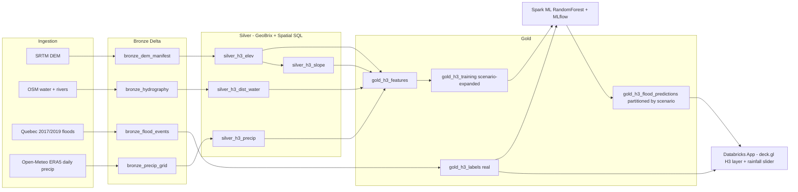

# Predicting Montreal's Next Flood with Public Data and the Databricks Lakehouse

*A reference architecture for spatial ML on Databricks — from SRTM rasters to an interactive deck.gl app, deployed with a single bundle command.*

---

In the spring of 2017 and again in 2019, the Ottawa and Saint-Laurent rivers overwhelmed their banks and flooded thousands of homes across Greater Montreal. Those events produced something rare in geospatial ML: high-quality, openly published flood-extent polygons from the Quebec government, paired with globally available terrain, hydrography, and precipitation data. That combination makes flood prediction a compelling showcase for what Databricks can do with spatial workloads today.

The `flood-prediction-sa` project is an end-to-end reference architecture that answers a simple question: **could we predict where Montreal floods next — using only public data and the Databricks Lakehouse?** It is not a production flood model, but it exercises every layer of the stack that a production system would need: raster and vector ingestion, H3-based feature engineering, scenario-aware ML training, MLflow model management, and an interactive Databricks App for stakeholder exploration.

This post walks through the architecture, the key design decisions, and the trade-offs — with code.

## The data sources

Everything is publicly available and requires no authentication:

- **SRTM DEM** (~30 m global elevation tiles) from AWS Open Data.
- **OSM hydrography** — water polygons and rivers pulled from the Overpass API, plus building footprints for an exposure layer.
- **Quebec 2017/2019 flood polygons** — the official "Territoire inondé" dataset from the Ministere de l'Environnement's ArcGIS Feature Service.
- **Open-Meteo ERA5 daily precipitation** — ~4 years of historical precipitation on a 0.2-degree grid, summarised into per-point climatology (annual total, P99 24h, P99 5-day).

The pipeline is parameterised by AOI bounding box, so the same bundle retargets any city by overriding a few variables at deploy time.

## The medallion pipeline

The project follows a standard bronze-silver-gold medallion architecture with H3 resolution 9 (~174 m edge length) as the universal spatial join key.



**Bronze** stores raw files and geometry strings — one row per DEM tile manifest entry, one row per OSM feature, one row per flood polygon. **Silver** tessellates everything onto the H3 grid: elevation, slope, distance-to-water, precipitation climatology, and building density. **Gold** joins them into a single feature table and produces the training set and scored predictions.

## Two geospatial superpowers, together

The silver layer leans on two complementary toolkits:

**GeoBrix RasterX** handles the raster side. It reads SRTM `.hgt` tiles via its GDAL driver, clips them to the AOI polygon, and makes them available as Spark DataFrames. The pixel-to-H3 tessellation aggregates ~30 m elevation pixels into per-cell averages and minimums, and slope is approximated from the elevation neighbourhood of each H3 cell using `h3_kring`.

**Databricks Spatial SQL** (the `ST_*` and `h3_*` built-ins available since DBR 17.1) handles the vector side. The gold label step uses `ST_GeomFromGeoJSON` and `ST_Intersects` to tag each H3 cell that falls inside a 2017/2019 flood polygon:

```sql
CREATE OR REPLACE TABLE gold_h3_labels AS
WITH centroids AS (
  SELECT h3, ST_GeomFromGeoJSON(h3_centerasgeojson(h3)) AS geom
  FROM gold_h3_features
)
SELECT c.h3,
       CASE WHEN COUNT(f.geom) > 0 THEN 1 ELSE 0 END AS label_real
FROM centroids c
LEFT JOIN v_flood_polys f ON ST_Intersects(c.geom, f.geom)
GROUP BY c.h3
```

The distinction matters: raster pipelines (DEM, satellite imagery, LiDAR) need pixel-level operations — reprojection, resampling, kernel convolutions. Vector pipelines (points, lines, polygons) need geometric predicates — intersection, distance, containment. A real geospatial lakehouse needs both, and this project shows them working in the same job.

## The rainfall-scenario trick

A flood model that ignores rainfall is not very useful. But historical flood polygons only tell you what happened under one specific storm — they do not tell you what would happen under a 200 mm deluge. The solution here is **scenario expansion**: every H3 cell is replicated across a set of discrete 24-hour rainfall levels (by default 10, 30, 60, 100, 150, and 200 mm), and the Random Forest trains on `scenario_24h_mm` as a first-class feature alongside terrain and climatology.

```sql
WITH feats AS (SELECT * FROM gold_h3_features),
scen(scenario_24h_mm) AS (VALUES (10),(30),(60),(100),(150),(200)),
cross AS (
  SELECT f.*, CAST(s.scenario_24h_mm AS DOUBLE) AS scenario_24h_mm
  FROM feats f CROSS JOIN scen s
),
scored AS (
  SELECT *,
    LEAST(1.0, scenario_24h_mm / 150.0) AS rain_factor,
    -- normalised terrain scores omitted for brevity
    ...
  FROM cross
)
SELECT *, CASE WHEN (susceptibility * rain_factor) + noise > 0.5
               THEN 1 ELSE 0 END AS label_synthetic
FROM scored
```

After training, the model scores every cell at every scenario and writes the results as partitions of `gold_h3_flood_predictions`, keyed on `(aoi_name, scenario_24h_mm)`. When the user drags the rainfall slider in the app, the frontend fetches a different partition — not a re-inference. The result is sub-second map updates.

## Hybrid labels: honest about what is synthetic

Training uses a **rainfall-aware synthetic susceptibility** label — a weighted combination of low elevation, proximity to water, low slope, and wet climatology, scaled by a rain factor that saturates at ~150 mm. Deterministic pseudo-noise (keyed on `xxhash64(h3, scenario_24h_mm)`) adds variance so the decision boundary is not perfectly smooth.

The **real 2017/2019 flood polygons are held out entirely** and used only for validation metrics (precision and recall displayed live in the app) and the map overlay. This is a deliberate demo pattern: it lets stakeholders see how well the synthetic model aligns with observed events, while making clear that a production system would substitute expanded historical data, insurance claims, or radar-based quantitative precipitation estimates (QPE) for the synthetic signal.

## MLflow and Unity Catalog

The training notebook logs metrics, feature importances, and the fitted Spark ML pipeline to MLflow, then registers the model in Unity Catalog under a three-part name (`catalog.schema.flood_rf`). Because the entire pipeline is parameterised by AOI, you can retrain for a different city by overriding bundle variables — the same registered model name, different version.

## The interactive Databricks App

The app is a **FastAPI** backend serving a **React + deck.gl** single-page application. The map renders flood probability on an `H3HexagonLayer` with a Viridis colour ramp and slight 3D extrusion — higher probability cells literally stand out.

```typescript
const hexLayer = new H3HexagonLayer<PredictionCell>({
  id: "flood-hex",
  data: cells,
  pickable: true,
  extruded: true,
  elevationScale: 20,
  getHexagon: (d) => d.h3,
  getFillColor: (d) => viridis(d.flood_prob),
  getElevation: (d) => d.flood_prob * 40,
  opacity: 0.75,
});
```

Key UX features:

- **24-hour rainfall slider** that snaps to pre-scored scenario partitions for instant map updates.
- **Address lookup** (via Nominatim) that geocodes a query, resolves the containing H3 cell, and returns a per-cell sweep across all scenarios — so you can see how flood risk at a specific address ramps with rainfall.
- **Historical flood overlay** — the 2017/2019 polygons are lazy-loaded per year and rendered as translucent GeoJSON layers with depth-testing disabled to avoid z-fighting with the hex grid.
- **Live precision and recall** versus the real events, plus exposure metrics (expected buildings at risk) computed from the OSM building footprint layer.
- **Dark, light, and voyager basemaps** via MapLibre + CARTO vector tiles.

The backend authenticates to the workspace SQL warehouse via the Databricks Apps service principal — no tokens baked into the app code.

## Asset Bundles: one command to deploy everything

The project ships as a Databricks Asset Bundle. A single `databricks bundle deploy -t dev` provisions the Unity Catalog schema, Volume, registered model, a multi-task job (wiring the four notebooks with GeoBrix cluster libraries), and the App resource. The `dev` target uses `mode: development`, which auto-prefixes every resource name with `dev_<username>_` so multiple developers can iterate safely on the same workspace.

## Cost and future work

The full pipeline (ingest, silver, gold, train, score) runs in roughly 10-20 minutes of wall time on a DBR 17.3 job cluster. The app itself runs on a serverless SQL warehouse, so there is no always-on compute cost when nobody is using it.

What would make this production-grade:

- **HRDEM 1 m DEM** from NRCan instead of SRTM 30 m — the pipeline is tile-agnostic, so swapping the DEM source only changes the ingest step.
- **Radar-based QPE** (e.g., ECCC HRDPS) for real observed rainfall intensity instead of ERA5 climatology.
- **Expanded historical labels** — additional flood events, insurance claims data, or field surveys to replace the synthetic susceptibility.
- **Streaming ingestion** of live precipitation forecasts to power real-time alerts instead of scenario sliders.

## Try it yourself

The full source is at [github.com/mathieupelletier-db/flood-prediction-sa](https://github.com/mathieupelletier-db/flood-prediction-sa). To deploy:

```bash
# Build the React SPA
cd src/app/client && bun install && bun run build && cd ../../..

# Deploy the bundle
databricks bundle deploy -t dev

# Run the pipeline (ingest -> silver -> gold -> train/score)
databricks bundle run flood_pipeline -t dev

# Launch the app
databricks bundle run flood_app -t dev
```

You will need a Unity Catalog workspace with DBR 17.1+, a serverless SQL warehouse, and GeoBrix installed on the job cluster. See the repo's README for the full prerequisites.

The same four commands, with different `--var` overrides for the bounding box, will produce a flood prediction app for any city on Earth that has SRTM coverage. Which, conveniently, is all of them.
