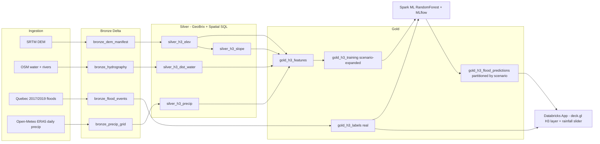

# Flood Prediction Demo - Greater Montreal

End-to-end flood prediction pipeline on Databricks, combining:

- **GeoBrix RasterX** for raster ingestion, clipping, slope derivation and H3 tessellation
  of a digital elevation model.
- **Databricks Spatial SQL** (`ST_*` and `h3_*` built-ins, DBR 17.1+) for vector
  operations (distance to water, intersection with historical flood polygons,
  nearest-neighbour precipitation assignment).
- **Open-Meteo ERA5 historical archive** for 10+ years of daily precipitation on
  a 0.1-degree grid, summarised into per-cell climatology (annual total, P99 24h,
  P99 5-day).
- **Spark ML `RandomForestClassifier`** trained on a **rainfall-scenario-expanded**
  dataset (each H3 cell replicated across multiple 24h rainfall levels) so the
  model learns an actual rainfall response, with **MLflow** tracking and Unity
  Catalog model registration.
- A **Databricks App** (FastAPI + React + deck.gl) that visualises per-H3 flood
  probability over a dark basemap, with an **interactive 24-hour rainfall slider**
  that switches between pre-scored rainfall partitions, plus a toggleable overlay
  of the 2017 / 2019 historical flood polygons for validation.

The ingestion is **parameterised by AOI**; the default is a bbox around Greater
Montreal but any bbox can be passed via bundle variables to retarget the demo at a
different city.

```
flood-prediction-sa/
├── databricks.yml              # Bundle root, AOI + catalog/schema vars
├── resources/
│   ├── storage.yml             # Schema, Volume, registered model
│   ├── pipeline.yml            # Job wiring the 4 notebooks + GeoBrix libraries
│   └── app.yml                 # Databricks App resource
├── src/
│   ├── notebooks/
│   │   ├── 01_ingest.py              # DEM + hydro + flood polygons  ->  bronze Delta
│   │   ├── 02_silver_geobrix.py      # RasterX + Spatial SQL          ->  silver H3 tables
│   │   ├── 03_gold_features_labels.py# Feature engineering + hybrid labels
│   │   └── 04_train_and_score.py     # Spark ML, MLflow, scored Delta
│   └── app/                          # Databricks App
│       ├── app.yaml                  # Databricks Apps launch config
│       ├── main.py                   # FastAPI backend
│       ├── requirements.txt
│       └── client/                   # React + deck.gl SPA
└── README.md
```

## Architecture



## Parameterisation

Change a city by overriding bundle variables at deploy time, or edit the defaults
in `databricks.yml`:

```bash
databricks bundle deploy -t dev \
  --var="aoi_name=quebec_city" \
  --var='aoi_bbox_wkt=POLYGON((-71.40 46.70, -71.10 46.70, -71.10 46.90, -71.40 46.90, -71.40 46.70))' \
  --var="aoi_bbox_min_lon=-71.40" --var="aoi_bbox_min_lat=46.70" \
  --var="aoi_bbox_max_lon=-71.10" --var="aoi_bbox_max_lat=46.90"
```

The same Delta tables are partitioned by `aoi_name`, so multiple AOIs can coexist
and be switched in the app via the AOI dropdown.

## Rainfall scenarios

The model takes a 24-hour rainfall value (`scenario_24h_mm`) as a first-class
feature alongside terrain and climatology. The pipeline pre-scores every H3 cell
at a set of discrete rainfall levels (default `10,30,60,100,150,200` mm) and
writes them as partitions of `gold_h3_flood_predictions`. The app queries the
nearest partition on every slider move, which keeps map updates fast and makes
the demo a clean "what if" experience:

```bash
databricks bundle deploy -t dev \
  --var="scenarios_24h_mm=25,50,75,100,150,200,250"
```

Changing the list re-runs steps 3 + 4 and creates new partitions; the app picks
them up automatically via `/api/scenarios`.

## Prerequisites

- Unity Catalog workspace on AWS or Azure with:
  - DBR **17.1+** runtime available (needed for built-in Spatial SQL).
  - A **Serverless SQL Warehouse** the app can bind to. Note its id and set
    `var.warehouse_id` (or the `DATABRICKS_WAREHOUSE_ID` env in the bundle target).
  - GeoBrix installed on the job cluster. The `resources/pipeline.yml` task uses
    both the Maven bundle and the `databricks-labs-geobrix` PyPI wheel - pin the
    exact versions your workspace supports (see
    [GeoBrix docs](https://databrickslabs.github.io/geobrix/docs/installation)).
- The Databricks CLI 0.239.0+ (for Apps resource support).
- `bun` (or `npm`) locally if you want to build the React SPA before deploy.

## Build the React SPA

```bash
cd src/app/client
bun install           # or: npm ci
bun run build         # emits ./dist
cd ../../..
```

The FastAPI backend in `src/app/main.py` serves `client/dist` at `/`, so the SPA
is included in the app bundle by simply shipping the `dist/` directory alongside
`main.py`.

## Deploy and run

```bash
# 1. Deploy bundle (schema, volume, registered model, job, app)
databricks bundle deploy -t dev

# 2. Run the 4-step pipeline (ingest -> silver -> gold -> train/score)
databricks bundle run flood_pipeline -t dev

# 3. Start the Databricks App
databricks bundle run flood_app -t dev

# 4. (Optional) stream logs
databricks apps logs flood-prediction-dev
```

Open the app URL printed by step 3 to see an interactive dark-themed deck.gl
map of H3 flood probability over Greater Montreal, with a toggle to overlay the
2017 / 2019 historical flood polygons and a precision / recall readout versus
those real events.

## Local dev of the app

```bash
# Terminal 1 - backend
cd src/app
uv pip install -r requirements.txt
export DATABRICKS_HOST=<workspace>.cloud.databricks.com
export DATABRICKS_HTTP_PATH=/sql/1.0/warehouses/<id>
export DATABRICKS_TOKEN=<PAT>
export DATABRICKS_CATALOG=flood_demo DATABRICKS_SCHEMA=montreal_dev
uvicorn main:app --reload --port 8000

# Terminal 2 - frontend (Vite dev server proxies /api to :8000)
cd src/app/client
bun run dev
```

## Notes and trade-offs

- **DEM resolution.** We use SRTM 1-arc-second (~30 m) because it's globally
  available from AWS Open Data without auth. For a real demo in Montreal you can
  swap in **HRDEM** (1 m) from NRCan - change `01_ingest.py::build_dem` and keep
  everything else the same. The pipeline is tile-agnostic.
- **Labels are hybrid.** Training uses a rainfall-aware synthetic label
  (susceptibility from low elevation + near water + low slope + wet climatology,
  multiplied by a rainfall factor that saturates at ~150 mm) because real flood
  polygons cover a small fraction of cells. Each cell is replicated across the
  configured rainfall scenarios so the model actually learns the rainfall
  response. The real 2017 / 2019 labels are held out and used only for
  validation metrics and the map overlay - this is the right pattern to show
  since a production pipeline would later replace the synthetic signal with
  expanded historical data, insurance claims, radar-based QPE, etc.
- **H3 resolution** defaults to 9 (~174 m edge). Drop to 8 for fewer, larger
  cells or go to 10 for finer detail at higher compute cost.
- **Spatial SQL requirement.** Notebooks `02` and `03` rely on DBR 17.1+ built-in
  `ST_*` and `h3_*` functions. If running on older DBR, swap `ST_Distance` /
  `ST_Intersects` for GeoBrix `VectorX` equivalents and `h3_centerasgeojson` for
  the H3 library's Python UDFs.

## Cleanup

```bash
databricks bundle destroy -t dev
```
