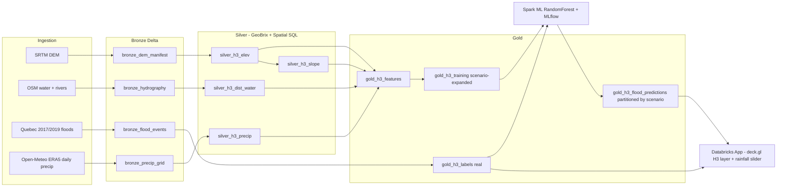

# Flood Prediction Solution Accelerator

[](https://databricks.com)
[](https://docs.databricks.com/en/data-governance/unity-catalog/index.html)
[](https://docs.databricks.com/en/compute/serverless.html)

End-to-end flood prediction pipeline on Databricks, combining:

- **GeoBrix RasterX** (lightweight tier) for raster ingestion, clipping and H3
tessellation of a digital elevation model — pure Python, so the whole pipeline
runs on **serverless** compute.
- **Databricks Spatial SQL** (`ST_*` and `h3_*` built-ins, DBR 17.1+) for vector
operations (distance to water, intersection with historical flood polygons,
nearest-neighbour precipitation assignment).
- **Open-Meteo ERA5 historical archive** for 10+ years of daily precipitation on
a 0.1-degree grid, summarised into per-cell climatology (annual total, P99 24h,
P99 5-day).
- **Spark ML `RandomForestClassifier`** trained on a **rainfall-scenario-expanded**
dataset (each H3 cell replicated across multiple 24h rainfall levels) so the
model learns an actual rainfall response, with **MLflow** tracking and Unity
Catalog model registration.
- A **Databricks App** (FastAPI + React + deck.gl) that visualises per-H3 flood
probability over a dark basemap, with an **interactive 24-hour rainfall slider**
that switches between pre-scored rainfall partitions, plus a toggleable overlay
of the 2017 / 2019 historical flood polygons for validation.

The ingestion is **parameterised by a list of AOIs** (`var.aois_json`). The
pipeline fans out per AOI via a `for_each_task`, and every Delta table is
partitioned by `aoi_name` so multiple cities co-exist in the same catalog and
appear side-by-side in the App's AOI dropdown. The default registry ships
Greater Montreal + Manhattan; add or override entries to retarget any city.

```
flood-prediction-sa/
├── databricks.yml              # Bundle root, AOI + catalog/schema vars
├── resources/
│   ├── storage.yml             # Schema, Volume, registered model
│   ├── pipeline.yml            # Serverless job wiring the 4 notebooks
│   └── app.yml                 # Databricks App resource + runtime config/env
├── notebooks/
│   ├── 01_ingest.py                  # DEM + hydro + flood polygons  ->  bronze Delta
│   ├── 02_silver_geobrix.py          # RasterX + Spatial SQL          ->  silver H3 tables
│   ├── 03_gold_features_labels.py    # Feature engineering + hybrid labels
│   └── 04_train_and_score.py         # Spark ML, MLflow, scored Delta
├── src/
│   └── app/                          # Databricks App (launch command and env
│       │                             # live in resources/app.yml)
│       ├── main.py                   # FastAPI backend
│       ├── requirements.txt
│       └── client/                   # React + deck.gl SPA
├── scripts/cleanup.sh                # Helper for `databricks bundle destroy`
├── requirements.txt                  # Local dev / IDE deps
├── LICENSE.md / NOTICE.md / CONTRIBUTING.md / SECURITY.md
└── README.md
```

## Architecture


```mermaid
flowchart LR
  subgraph ingest [Ingestion]
    DEM[SRTM DEM]
    HYDRO[OSM water + rivers]
    FLOOD[Quebec 2017/2019 floods]
    PRECIP[Open-Meteo ERA5 daily precip]
  end
  subgraph bronze [Bronze Delta]
    B1[bronze_dem_manifest]
    B2[bronze_hydrography]
    B3[bronze_flood_events]
    B4[bronze_precip_grid]
  end
  subgraph silver [Silver - GeoBrix + Spatial SQL]
    S1[silver_h3_elev]
    S2[silver_h3_slope]
    S3[silver_h3_dist_water]
    S4[silver_h3_precip]
  end
  subgraph gold [Gold]
    G1[gold_h3_features]
    G2[gold_h3_labels real]
    G3[gold_h3_training scenario-expanded]
    G4[gold_h3_flood_predictions partitioned by scenario]
  end
  ML[Spark ML RandomForest + MLflow]
  APP[Databricks App - deck.gl H3 layer + rainfall slider]

  DEM --> B1 --> S1 --> G1
  HYDRO --> B2 --> S3 --> G1
  FLOOD --> B3 --> G2 --> ML
  PRECIP --> B4 --> S4 --> G1
  S1 --> S2 --> G1
  G1 --> G3 --> ML --> G4 --> APP
  G2 --> APP
```


## Parameterisation

### The AOI registry (`var.aois_json`)

`databricks.yml` defines a JSON-array variable `aois_json`. The pipeline job is
a stack of `for_each_task` stages that iterate over this list, so each AOI gets
its own ingest → silver → gold → train_and_score run, all writing into the
same catalog under their own `aoi_name` partition.

The default registry contains two entries: Greater Montreal (with MELCC flood
polygons) and Manhattan (no historical floods). To retarget the demo, edit the
list in `databricks.yml` or override at deploy time:

```bash
# Replace the registry inline
databricks bundle deploy -t dev --var='aois_json=[
  {"name":"greater_montreal","min_lon":"-74.05","min_lat":"45.30","max_lon":"-73.30","max_lat":"45.80","wkt":"POLYGON((-74.05 45.30, -73.30 45.30, -73.30 45.80, -74.05 45.80, -74.05 45.30))","flood_source":"melcc","cems_urls":"","cems_year_default":""},
  {"name":"quebec_city","min_lon":"-71.40","min_lat":"46.70","max_lon":"-71.10","max_lat":"46.90","wkt":"POLYGON((-71.40 46.70, -71.10 46.70, -71.10 46.90, -71.40 46.90, -71.40 46.70))","flood_source":"melcc","cems_urls":"","cems_year_default":""}
]'

# Or keep the registry in a file
databricks bundle deploy -t dev --var="aois_json=$(cat my_aois.json)"
```

Each registry entry must include:

| key | value |
|---|---|
| `name` | short slug, also used as the volume subfolder and partition key |
| `min_lon` / `min_lat` / `max_lon` / `max_lat` | bbox in EPSG:4326 |
| `wkt` | same bbox as a WKT polygon (used for raster clipping) |
| `flood_source` | `"melcc"` \| `"cems"` \| `"none"` (see next section) |
| `cems_urls` | comma-separated GeoJSON URLs (only when `flood_source=cems`) |
| `cems_year_default` | fallback year for CEMS features with no year tag |

### Per-AOI parallelism

`var.for_each_concurrency` (default `1`) controls how many AOIs run
concurrently within each stage. On serverless each iteration gets its own
compute, so raising this trades cost for wall-clock time:

```bash
databricks bundle deploy -t dev --var=for_each_concurrency=2
```

### Why partition by `aoi_name` everywhere

Every bronze, silver, and gold Delta table has `aoi_name` as a partition
column, and the notebooks set
`spark.sql.sources.partitionOverwriteMode = "dynamic"` so a `mode("overwrite")`
write only replaces the active AOI's partition. Without that, running the
pipeline for AOI #2 would erase AOI #1's rows on every shared table — and the
App's AOI dropdown would shrink back to whichever AOI ran last.

## Historical flood polygon source (`flood_source`)

`bronze_flood_events` and the App's validation overlay come from one of three
sources, selected via the `flood_source` bundle variable:

| `flood_source` | What it pulls | Coverage | When to use |
|---|---|---|---|
| `melcc` *(default)* | Quebec MDDELCC ArcGIS service for the 2017 + 2019 ZIS decree polygons | Quebec only | Default Montreal demo and any other Quebec AOI |
| `cems` | [Copernicus EMS Rapid Mapping](https://emergency.copernicus.eu/mapping/list-of-activations-rapid) GeoJSON products you point at via `cems_urls`, or any GeoJSON files dropped in `<volume>/floods/cems_input/` | Global, but only major declared events | Any non-Quebec AOI where a CEMS activation exists |
| `none` | Writes an empty `bronze_flood_events`. The model still trains on the synthetic susceptibility label; the historical-flood overlay and live precision/recall readout disappear from the App | Any | Any AOI with no historical-flood data we trust |

CEMS example — adding Cedar Rapids 2008 floods (activation EMSR007) as a third
AOI alongside the defaults:

```bash
databricks bundle deploy -t dev --var='aois_json=[
  {"name":"greater_montreal","min_lon":"-74.05","min_lat":"45.30","max_lon":"-73.30","max_lat":"45.80","wkt":"POLYGON((-74.05 45.30, -73.30 45.30, -73.30 45.80, -74.05 45.80, -74.05 45.30))","flood_source":"melcc","cems_urls":"","cems_year_default":""},
  {"name":"manhattan","min_lon":"-74.05","min_lat":"40.68","max_lon":"-73.90","max_lat":"40.88","wkt":"POLYGON((-74.05 40.68, -73.90 40.68, -73.90 40.88, -74.05 40.88, -74.05 40.68))","flood_source":"none","cems_urls":"","cems_year_default":""},
  {"name":"cedar_rapids","min_lon":"-91.80","min_lat":"41.90","max_lon":"-91.55","max_lat":"42.10","wkt":"POLYGON((-91.80 41.90, -91.55 41.90, -91.55 42.10, -91.80 42.10, -91.80 41.90))","flood_source":"cems","cems_urls":"https://emergency.copernicus.eu/.../EMSR007_AOI01_observed_event_a.geojson,https://emergency.copernicus.eu/.../EMSR007_AOI02_observed_event_a.geojson","cems_year_default":"2008"}
]'
```

If the GeoJSON URL isn't readily linkable from the activation page, just download
the GeoJSON locally and upload it to
`/Volumes/<catalog>/<schema>/raw/<aoi_name>/floods/cems_input/`. Notebook 01 picks
up everything in that directory and merges it. Filenames containing a 4-digit
year (e.g. `EMSR201_aoi01_2017_DEL.geojson`) get auto-tagged for the App's
per-year overlay; everything else falls back to `cems_year_default`.

> **Why GeoJSON only?** Most CEMS Rapid Mapping products are also offered as
> GeoJSON in addition to Shapefile. Supporting Shapefile zips in-notebook would
> drag in a heavy GDAL/fiona dependency for marginal benefit — pick the GeoJSON
> download from the CEMS portal instead.

Skip mode for AOIs with no historical data: set `"flood_source": "none"` in
that AOI's registry entry. Example:

```json
{"name":"miami","min_lon":"-80.40","min_lat":"25.70","max_lon":"-80.10","max_lat":"25.90","wkt":"POLYGON((-80.40 25.70, -80.10 25.70, -80.10 25.90, -80.40 25.90, -80.40 25.70))","flood_source":"none","cems_urls":"","cems_year_default":""}
```

## Rainfall scenarios

The model takes a 24-hour rainfall value (`scenario_24h_mm`) as a first-class
feature alongside terrain and climatology. The pipeline pre-scores every H3 cell
at a set of discrete rainfall levels (default `10,30,60,100,150,200` mm) and
writes them as partitions of `gold_h3_flood_predictions`. The app queries the
nearest partition on every slider move, which keeps map updates fast and makes
the demo a clean "what if" experience:

```bash
databricks bundle deploy -t dev \
  --var="scenarios_24h_mm=25,50,75,100,150,200,250"
```

Changing the list re-runs steps 3 + 4 and creates new partitions; the app picks
them up automatically via `/api/scenarios`.

## Prerequisites

- Unity Catalog workspace on AWS, Azure or GCP with:
  - **Serverless compute for jobs** enabled. The pipeline defines no clusters, so
  there is no node SKU to pick and the bundle deploys unchanged on all three
  clouds.
  - A **Serverless SQL Warehouse** the app can bind to. Note its id and set
  `var.warehouse_id` (or the `DATABRICKS_WAREHOUSE_ID` env in the bundle target).
- GeoBrix needs no setup. Notebook `02` installs it with a notebook-scoped
  `%pip` from the public release wheel, using the
  [lightweight tier](https://databrickslabs.github.io/geobrix/docs/quick-start?tier=lightweight)
  — pure Python, so no JAR, no GDAL native libraries and no init script.
  GeoBrix 0.4.3 requires `pyspark>=4.0`, which is why the job pins serverless
  environment `client: "4"`; on `client: "3"` (pyspark 3.5.2) the install fails
  with a `ResolutionImpossible` against the immutable package constraints.
- The Databricks CLI 0.239.0+ (for Apps resource support).
- `npm` (or `bun`) locally if you want to build the React SPA before deploy.

## Build the React SPA

```bash
cd src/app/client
npm ci                # or: bun install
npm run build         # emits ./dist  (or: bun run build)
cd ../../..
```

The FastAPI backend in `src/app/main.py` serves `client/dist` at `/`, so the SPA
is included in the app bundle by simply shipping the `dist/` directory alongside
`main.py`.

## Deploy and run

```bash
# 1. Deploy bundle (schema, volume, registered model, job, app)
databricks bundle deploy -t dev

# 2. Run the 4-step pipeline (ingest -> silver -> gold -> train/score)
databricks bundle run flood_pipeline -t dev

# 3. Start the Databricks App
databricks bundle run flood_app -t dev

# 4. One-time per workspace: grant the app's auto-created service principal
#    USE CATALOG on the target catalog. Schema-level USE_SCHEMA + SELECT are
#    already declared in resources/storage.yml and applied by `bundle deploy`.
SP_ID=$(databricks apps get flood-prediction-dev --output json \
          | jq -r .service_principal_client_id)
databricks api post /api/2.0/sql/statements/ --json "$(cat <<EOF
{
  "warehouse_id": "<your-warehouse-id>",
  "statement": "GRANT USE CATALOG ON CATALOG \`<your-catalog>\` TO \`${SP_ID}\`",
  "wait_timeout": "30s"
}
EOF
)"

# 5. (Optional) stream logs
databricks apps logs flood-prediction-dev
```

Open the app URL printed by step 3 to see an interactive dark-themed deck.gl
map of H3 flood probability over Greater Montreal, with a toggle to overlay the
2017 / 2019 historical flood polygons and a precision / recall readout versus
those real events.

## Local dev of the app

```bash
# Terminal 1 - backend
cd src/app
uv pip install -r requirements.txt
export DATABRICKS_HOST=<workspace>.cloud.databricks.com
export DATABRICKS_HTTP_PATH=/sql/1.0/warehouses/<id>
export DATABRICKS_TOKEN=<PAT>
export DATABRICKS_CATALOG=flood_demo DATABRICKS_SCHEMA=montreal_dev
uvicorn main:app --reload --port 8000

# Terminal 2 - frontend (Vite dev server proxies /api to :8000)
cd src/app/client
npm run dev           # or: bun run dev
```

## Underwriter Q&A (Genie chatbot)

The app's side panel ships an optional chat experience for insurance
underwriters and portfolio analysts. It is backed by a **Databricks Genie
Space** that translates natural-language questions into SQL on a building-level
gold table (`gold_building_exposure`). The chatbot can answer aggregate,
slicing, top-N, and scenario-stress questions; it does **not** answer "how does
the model work" or trigger map actions (see [KNOWN_LIMITATIONS.md](KNOWN_LIMITATIONS.md)).

### What it can answer

```text
"What is total expected loss in Greater Montreal at the 100 mm scenario?"
"Top 20 buildings by expected loss in Greater Montreal at 150 mm"
"Residential vs commercial expected loss breakdown at 100 mm"
"How many buildings are in each risk tier in Greater Montreal at 100 mm?"
"Compare aggregate expected loss at 60, 100, and 150 mm in Greater Montreal"
"Which H3 cells carry the most expected loss at 100 mm?"
"How many severe-risk buildings sit inside the 2017 flood polygon?"
"How many buildings exceed $50K expected loss at 100 mm in Greater Montreal?"
```

Each user message is silently prefixed on the server with the current map
context ("AOI=greater_montreal; scenario=100 mm/24h") so questions like "total
EL at this scenario" work without typing the values.

### Data surface

The space sees exactly four tables under `${var.catalog}.${schema}`:

| Table                              | Granularity                            | Used for                                |
| ---------------------------------- | -------------------------------------- | --------------------------------------- |
| `gold_building_exposure`           | (aoi, scenario, building)              | Every underwriter question              |
| `gold_underwriting_assumptions`    | (building_class)                       | Replacement cost + loss-severity config |
| `gold_flood_events`                | (aoi, year, polygon)                   | Historical validation questions         |
| `gold_scenarios` + `gold_aoi`      | (aoi[, scenario])                      | Dimension lookups                       |

`gold_building_exposure` is the single biggest accuracy lever - it's
pre-denormalized so 90% of underwriter questions are single SELECTs. Schema:
`aoi_name, scenario_24h_mm, osm_id, building_type, residential, h3, lon, lat,
flood_prob, risk_tier, brc_usd, loss_severity, expected_loss_usd, min_elev,
slope_deg, dist_to_water_m, inside_historical_flood`. Every column carries a
COMMENT (set in `04_train_and_score.py`) so Genie's auto-generated table
summary lands accurately without any space-side hand-holding.

### Provision the space

DABs has no managed `genie_space` resource type yet, so the space is created
out-of-band with a one-line script:

```bash
GENIE_SPACE_ID=$(python scripts/genie_bootstrap.py \
    --profile      <databricks-cli-profile> \
    --catalog      flood_demo \
    --schema       montreal \
    --warehouse-id <sql-warehouse-id> \
    --grant-sp     <app-service-principal-application-id>)

databricks bundle deploy -t dev --var=genie_space_id=$GENIE_SPACE_ID
```

The script is idempotent (re-running updates the existing space rather than
creating a duplicate), reads the full space definition from
[resources/genie/flood_underwriter.json](resources/genie/flood_underwriter.json)
(instructions, 8 certified questions with canonical SQL, sample questions),
substitutes `{catalog}`/`{schema}`, optionally grants the app SP CAN_QUERY on
the space, and prints the resulting `space_id` so the deploy can rewire the
app's `DATABRICKS_GENIE_SPACE_ID` env var.

If `genie_space_id` is empty (the default), the chat panel hides itself - the
rest of the app continues to work normally. This makes the chatbot a clean
opt-in for environments where Genie isn't enabled.

## Notes and trade-offs

- **DEM resolution.** We use SRTM 1-arc-second (~30 m) because it's globally
available from AWS Open Data without auth. For a real demo in Montreal you can
swap in **HRDEM** (1 m) from NRCan - change `01_ingest.py::build_dem` and keep
everything else the same. The pipeline is tile-agnostic.
- **Labels are hybrid.** Training uses a rainfall-aware synthetic label
(susceptibility from low elevation + near water + low slope + wet climatology,
multiplied by a rainfall factor that saturates at ~150 mm) because real flood
polygons cover a small fraction of cells. Each cell is replicated across the
configured rainfall scenarios so the model actually learns the rainfall
response. The real 2017 / 2019 labels are held out and used only for
validation metrics and the map overlay - this is the right pattern to show
since a production pipeline would later replace the synthetic signal with
expanded historical data, insurance claims, radar-based QPE, etc.
- **H3 resolution** defaults to 9 (~174 m edge). Drop to 8 for fewer, larger
cells or go to 10 for finer detail at higher compute cost.
- **Spatial SQL requirement.** Notebooks `02` and `03` rely on the built-in
`ST_*` and `h3_*` functions, which serverless and DBR 17.1+ both provide. On
older classic runtimes, swap `ST_Distance` / `ST_Intersects` for GeoBrix
`VectorX` equivalents and `h3_centerasgeojson` for the H3 library's Python UDFs.
- **DEM tile splitting.** Notebook `02` reads the DEM with
`.option("sizeInMB", "4")`. Do not drop this: the default emits one tile per
`.hgt` file, and tessellating a full 3601×3601 SRTM tile in one Python worker
runs it out of memory. Splitting also means a cell on a tile boundary is
reported once per tile, which is why the elevation query recombines the partial
averages with a pixel-count weighting rather than averaging the averages.

## Cleanup

```bash
databricks bundle destroy -t dev
# or use the helper:
./scripts/cleanup.sh
```

## Third-Party Package Licenses

&copy; 2026 Databricks, Inc. All rights reserved. The source in this project is provided subject to the Databricks License [https://databricks.com/db-license-source]. All included or referenced third party libraries and data sources are subject to the licenses set forth below.

### Python / JVM libraries

| Package | License | Copyright |
|---------|---------|-----------|
| `databricks-labs-geobrix` (RasterX, JAR + wheel) | Databricks License | Databricks, Inc. |
| `pyspark` | Apache 2.0 | The Apache Software Foundation |
| `mlflow` | Apache 2.0 | Databricks, Inc. |
| `databricks-sdk` | Apache 2.0 | Databricks, Inc. |
| `h3` (uber-h3-py) | Apache 2.0 | Uber Technologies, Inc. |
| `rasterio` | BSD-3-Clause | MapBox |
| `shapely` | BSD-3-Clause | Sean Gillies and contributors |
| `requests` | Apache 2.0 | Kenneth Reitz |

### App (FastAPI + React) libraries

| Package | License | Copyright |
|---------|---------|-----------|
| `fastapi` | MIT | Sebastián Ramírez |
| `uvicorn` | BSD-3-Clause | Encode OSS Ltd. |
| `databricks-sql-connector` | Apache 2.0 | Databricks, Inc. |
| `react`, `react-dom` | MIT | Meta Platforms, Inc. |
| `vite` | MIT | Evan You and Vite contributors |
| `deck.gl` | MIT | Uber Technologies, Inc. |
| `maplibre-gl` | BSD-3-Clause | MapLibre contributors |

### Data sources

| Dataset | License / Terms | Source |
|---------|-----------------|--------|
| SRTM 1-arc-second DEM | Public domain (US Government work) | USGS / NASA, distributed via AWS Open Data |
| OpenStreetMap water + rivers | ODbL 1.0 | OpenStreetMap contributors |
| Open-Meteo ERA5 historical archive | CC-BY 4.0 | Open-Meteo, derived from Copernicus ERA5 |
| Quebec 2017 / 2019 historical flood polygons | Creative Commons Attribution 4.0 (Données Québec) | Gouvernement du Québec / MELCC |


